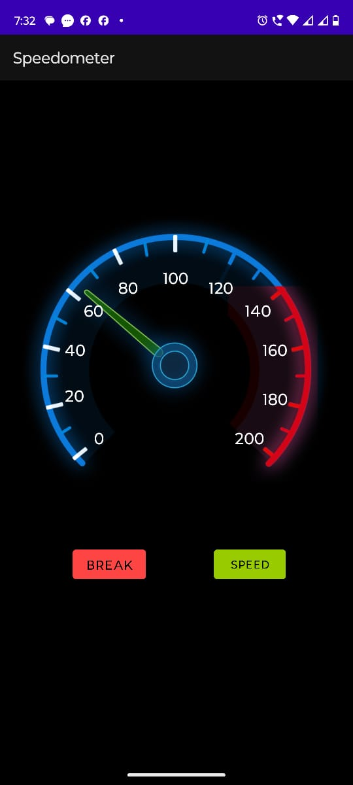

<h1 align="center">Speedometer in Kotlin</h1>
<h3 align="center">Developed a basic speedometer using Kotlin for Android.
It has 2 buttons (Speed and Brake)used to accelerate or decelerate the speed shown in the speedometer.
Used rotation class of kotlin to show the movements of the dial in the speedometer.
Can be used further as an actual speedometer in a vehicle.
</h3>

  

